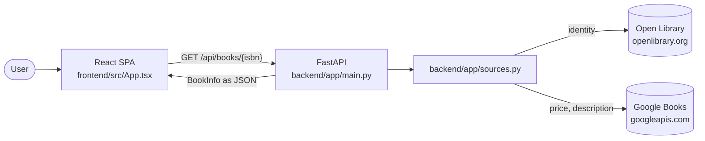
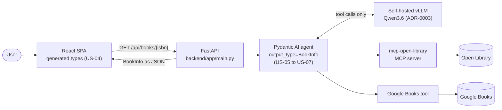

# 05 — Technical concept

## 1. Purpose and scope

This document describes how the system is put together: its components, the contract they share,
where data comes from, and how failure is handled.

It is not the requirements — those are `docs/03-requirements.md`, and this document implements them
rather than restating them. It is not a record of decisions either; those live in `docs/adr/`, and
are cited here rather than re-argued.

Two states are described throughout, and the distinction is load-bearing:

- **As built** — what the code in `backend/app/` and `frontend/src/` does today. This is the
  vertical-slice spike of [ADR-0004](adr/0004-vertical-slice-spike.md): deliberately throwaway, with
  no LLM, no agent and no MCP client.
- **As designed** — what US-01 through US-10 will make of it.

Present tense means the code does this now. "Will" means planned, and always names the story that
delivers it. Where the two diverge, both are given rather than the flattering one.

---

## 2. Architecture overview

### As built



Three hops, no intermediary. `main.py` validates and maps status codes; `sources.py` performs two
direct `httpx` calls and shapes the results; the React page renders them.

### As designed



The agent layer slots between the endpoint and the sources. The model never touches a source
directly and never supplies a fact: every value reaching `BookInfo` originates in a tool result
(rule 1, FR-09). Its only authored output is the description, and that is flagged (FR-10).

### Request walkthrough: one lookup of `9780132350884`

As built, tracing real code:

1. **`App.tsx` — `search()`.** The submit handler trims the entry, records
   `performance.now()`, and issues `fetch` to `http://localhost:8000/api/books/9780132350884`.
   `API_BASE` is a hardcoded constant; US-04 makes it configuration.
2. **CORS.** `main.py` registers `CORSMiddleware` with `allow_origins=["http://localhost:5173"]`.
   Without this the browser discards the response; curl never notices, which makes it a
   frontend-only failure mode.
3. **`main.py` — `_normalise()`.** Strips `-` and spaces, then matches `^\d{13}$`. On failure the
   endpoint raises **422** with a fixed message and no upstream call is made. There is no checksum
   and no ISBN-10 support yet — that is US-01 (FR-02, FR-03, FR-04).
4. **`sources.py` — `fetch_open_library()`.** `GET openlibrary.org/api/books` with
   `bibkeys=ISBN:9780132350884&format=json&jscmd=data`. The response is keyed by the bibkey; a
   missing key, a non-dict record, or a record without a title all yield `None`. On success it
   returns `Identity(title, authors, cover_url)`, taking `cover.large` or falling back to
   `cover.medium`.
5. **No identity, no result.** `BookInfo.title` is a required `str`, so if `fetch_open_library`
   returns `None` the endpoint raises **404** naming the ISBN. Today this single status covers both
   "no such book" and "Open Library is down" — see §7.
6. **`sources.py` — `fetch_google_books()`.** `GET googleapis.com/books/v1/volumes` with
   `q=isbn:9780132350884`, plus `key` when `GOOGLE_BOOKS_API_KEY` is in the environment. Returns
   `Commerce(price, currency, description)`, or `None` when the source failed or matched nothing.
7. **Assembly.** `sources` starts as `["open_library"]` and gains `"google_books"` only if
   `fetch_google_books` returned something (FR-11). `description_is_generated` is hardcoded `False`,
   which is honest because no LLM exists (FR-10). Missing description becomes `""`.
8. **Response.** FastAPI serialises `BookInfo` to JSON. `App.tsx` renders the table and stores
   endpoint, status, elapsed ms and the formatted body for the collapsed **API response** panel.

For the golden ISBN this returns "Clean Code" by Robert C. Martin with a cover URL in roughly a
second, with `price` and `currency` `null` — see §5 for why that is correct rather than broken.

---

## 3. Component responsibilities

| Module | Owns | Must not |
|---|---|---|
| `backend/app/models.py` | `BookInfo` and the `Source` literal — the single contract | Be duplicated anywhere, in either language (rule 2) |
| `backend/app/main.py` | HTTP surface, input normalisation, status mapping, CORS, `.env` loading | Talk to an upstream source directly |
| `backend/app/sources.py` | All upstream I/O, per-call timeouts, failure-to-`None`, and the `Identity` / `Commerce` shapes | Know about HTTP status codes or FastAPI |
| `frontend/src/App.tsx` | Entry form, result table, API-response panel | Hand-write the contract type (it does today — US-04) |
| `backend/tests/` | Verification against stubbed transports (NFR-06) | Reach the network |

The boundary that matters is between `main.py` and `sources.py`. `sources.py` reports failure as
`None` and knows nothing of status codes; `main.py` decides what a `None` means to a client. That
split is what lets US-10 introduce distinct error states without touching source code.

`Identity` and `Commerce` are deliberately not `BookInfo` fragments. They name what each source
*owns*, so the field-ownership rule in §5 is enforced by the type system rather than by convention.

---

## 4. The `BookInfo` data contract

`backend/app/models.py` holds the only definition of the contract (rule 2, FR-06):

| Field | Type | Notes |
|---|---|---|
| `isbn` | `str` | Always ISBN-13, whatever form was entered (FR-04) |
| `title` | `str` | Required — its absence means there is no result |
| `authors` | `list[str]` | May be empty |
| `cover_url` | `HttpUrl \| None` | `None` is expected; US-08 renders a placeholder (FR-14) |
| `price` | `Decimal \| None` | `None` is a designed state, not an error (rule 3, FR-13) |
| `currency` | `str \| None` | ISO 4217; `None` whenever `price` is `None` |
| `description` | `str` | Publisher-sourced, or model-written when FR-10 applies |
| `description_is_generated` | `bool` | The boundary of rule 1, made visible |
| `sources` | `list[Source]` | `open_library`, `google_books`, `llm` (FR-11, NFR-05) |

Two properties are worth stating because they are invisible until you read the wire:

**`price` serialises as a JSON string, not a number.** Pydantic renders `Decimal` as `"19.99"` to
avoid float error. A hand-written client that types `price` as `number` compiles cleanly and is
wrong — which is the drift rule 2 exists to prevent.

**`Decimal` must be constructed from a string.** `sources.py` uses `Decimal(str(amount))`, because
the JSON price arrives as a float and `Decimal(37.99)` carries the binary error through to the
response body as `37.990000000000002`.

### How the contract reaches the frontend

FastAPI derives `/openapi.json` from the Pydantic model, and US-04 (FR-19) will generate the
TypeScript type from that schema, wired into `npm run build` so a model change that is not
regenerated fails the build.

**Today it does not.** `App.tsx` hand-writes the `BookInfo` interface — the rule 2 violation
[ADR-0004](adr/0004-vertical-slice-spike.md) accepts and US-04 closes. It is correct only because it
was checked against `/openapi.json` by hand, which is precisely the manual step generation removes.

---

## 5. Data source strategy

Each field has exactly one owning source:

| Source | Owns | Why |
|---|---|---|
| Open Library (FR-07) | `title`, `authors`, `cover_url` | Authoritative for bibliographic identity; carries no pricing |
| Google Books (FR-08) | `price`, `currency`, `description` | The only source of commercial fields and a publisher blurb |

**Why the split rather than merging both.** If two sources can each supply a title, some rule has to
break the tie when they disagree, and any such rule is invisible to the reader of the result. Fixing
ownership per field means the answer to "where did this title come from" is always the same. Google
Books has noisier identity data (`docs/01-vision.md`), so it is not consulted for identity even when
it has an answer.

**Endpoint choice.** `fetch_open_library` uses `api/books?jscmd=data` rather than
`/isbn/{isbn}.json`. The latter returns author *keys* requiring a further request each; the former
returns author names and cover URLs inline, turning N+1 requests into one.

**`GOOGLE_BOOKS_API_KEY` is required, not optional.** Anonymous requests return HTTP 429 against an
exhausted shared daily quota — a finding from the spike, recorded in ADR-0004. The key is read from
the environment at call time and never appears in source (rule 7, NFR-03).

**A priced result is the exception, not the rule.** Google Books returns `saleability: NOT_FOR_SALE`
with no `listPrice` for much of its catalogue, including the golden ISBN `9780132350884`. So
`price: null` is the *normal* rendering for the project's own test fixture, and FR-13's "Not
available" is a main path rather than an edge case.

---

## 6. The planned agent layer (US-05 → US-07)

The spike calls both sources from Python. The design replaces that with a Pydantic AI agent:

- **Model.** A self-hosted vLLM endpoint serving `nvidia/Qwen3.6-35B-A3B-NVFP4`, reached through
  Pydantic AI's OpenAI-compatible provider with a custom `base_url`. Requests pass
  `chat_template_kwargs {"enable_thinking": false}` — Qwen3.6 is a reasoning model, and its thinking
  block interferes with structured extraction. See [ADR-0003](adr/0003-self-hosted-vllm-qwen.md).
- **Tools.** `mcp-open-library` as an MCP server for identity (US-05, FR-07); a Google Books tool for
  price and description (US-06, FR-08).
- **Output.** `output_type=BookInfo`, so the contract constrains the agent directly.
- **The boundary.** The model normalises the shape of tool output and writes a description when no
  publisher one exists. It supplies no facts (rule 1, FR-09). `description_is_generated` (FR-10) and
  `sources` (FR-11) are the evidence that makes the boundary checkable from a response alone
  (NFR-05) rather than merely asserted — US-07 delivers all three together.

### Two open risks

ADR-0003 records these as unresolved. Both must be confirmed with Surfgreen **before US-05 starts**,
because US-05 is the first story whose implementation depends on the answer.

| Risk | Why it is a risk | Fallback |
|---|---|---|
| **Structured output** — `output_type=BookInfo` needs guided decoding exposed through the OpenAI-compatible surface | A self-hosted vLLM build may omit it, expose it under a different parameter, or support it unreliably for an NVFP4-quantised model | Build `BookInfo` in Python from tool results; use the model only for the `description` string, validated by Pydantic with retry |
| **Tool calling** — the agent assumes well-formed tool-call requests | Tool-call support depends on the server being started with a matching parser; it is a deployment flag, not a model property | Orchestrate both sources from Python in fixed sequence, invoking the model once at the end |

Both fallbacks converge on less model agency and more deterministic Python. That makes FR-09 *easier*
to guarantee, not harder — what is lost is the agentic structure this repository also exists to
demonstrate. Note the fallbacks describe roughly what the spike already does.

---

## 7. Error handling and degradation

| Condition | As built | As designed |
|---|---|---|
| Malformed ISBN | 422, no upstream call | 422, plus an inline message naming the reason and client-side validation (FR-05, NFR-02, US-02) |
| Valid ISBN, no record | 404 naming the ISBN | A distinct "no book found" state naming the ISBN searched (FR-15, US-10) |
| Identity source unreachable | 404 — **indistinguishable from the above** | A distinct failure state offering retry, never a partial table (FR-16, US-10) |
| Price source unreachable | 200 with `price`/`currency` `null`, `sources` omitting `google_books` | The same, but specified rather than incidental (FR-17, US-10) |
| No price exists upstream | 200 with nulls; UI shows "Not available" | Unchanged (FR-13, US-09) |

**The mechanism.** `_get_json()` catches `httpx.HTTPError` and `ValueError` and returns `None`. Every
failure mode — connection refused, timeout, non-2xx, malformed JSON — collapses into the same value
as "this source has no record". The caller cannot tell them apart.

That collapse is the single largest gap between as-built and as-designed. FR-15 and FR-16 exist
precisely because "check the number" and "try again later" call for different user actions, and US-10
cannot deliver them until `sources.py` distinguishes failure from absence. Expect that story to
change the `None` return into something richer.

**Timeouts.** `TIMEOUT = httpx.Timeout(3.0)` applies per upstream call, so one unresponsive source
cannot hold the whole request open — the mechanism that makes NFR-01's 5-second p95 budget
achievable. The budget predates the agent, which will dominate it once added.

**Safe error reporting (NFR-08).** Met by construction: the only text reaching a client is a
hand-written `detail` string. No stack trace, upstream URL or credential can escape, because
`sources.py` discards exceptions at the boundary rather than propagating them.

---

## 8. Testing strategy (NFR-06)

Tests must run without live upstream calls — required both because the suite would otherwise be
flaky and quota-bound, and because rule 6 writes tests from Gherkin *before* the implementation
exists, which is only possible against stubs.

**The pattern**, already proven in `backend/tests/test_spike_smoke.py`:

- `_new_client()` in `sources.py` exists as a seam. Tests patch it to return an
  `httpx.AsyncClient` wrapping an `httpx.MockTransport`, so no socket is opened.
- `httpx.ASGITransport` drives the FastAPI app in-process — no server, no port.
- `asyncio_mode = "auto"` in `backend/pyproject.toml`; async tests need no decorator.

**Fixtures**, with two traps recorded so they are not rediscovered:

- `9780132350884` (*Clean Code*) is the golden fixture. It has **no price upstream**, so it exercises
  FR-13 and cannot exercise the priced path.
- `9783527823925` (*Clean Code für Dummies*) returns `"19.99"` / `EUR`, and has a null cover — so it
  serves as the priced fixture and an FR-14 placeholder case at once.
- `9780299999995` is absent from Open Library *today*. Absence is a property of the catalogue on a
  given day, not of the number, so this fixture must always be stubbed and never trusted live.

**Current state.** Three tests pass, covering the golden path, hyphen tolerance and 422 rejection.
They do not satisfy rule 6 — they were written after the code and from no scenario. Real tests begin
at US-01, derived from the Gherkin in `docs/04-user-stories.md`.

---

## 9. Deployment and local development

**Deployment is out of scope.** `docs/01-vision.md` excludes hosting and production operations. The
system is designed to run locally, and NFR-10 asks only that it start in one step.

```
backend:   uv run uvicorn app.main:app --reload     # :8000
frontend:  npm run dev                              # :5173
```

**Configuration.** Copy `.env.example` to `.env` and populate it. `main.py` calls `load_dotenv()`
against the repository root — one level above `backend/` — so the documented uvicorn command picks up
credentials with no extra flags. `.env` is gitignored; `.env.example` is committed and carries
placeholders only, listing every variable required (NFR-03, rule 7).

Required variables: `LLM_API_KEY`, `LLM_BASE_URL`, `LLM_MODEL` (unused until US-05) and
`GOOGLE_BOOKS_API_KEY`.

**The two ports are coupled by CORS.** `allow_origins=["http://localhost:5173"]` is hardcoded in
`main.py`. Running Vite on another port breaks the browser path while leaving curl working — worth
knowing before debugging the wrong layer.

**Quality gates (NFR-07),** all of which must pass on every merged change:

```
backend:   uv run pytest  |  uv run ruff check .  |  uv run mypy app
frontend:  npm run lint   |  npm run build
```

---

## 10. What is not yet implemented

[ADR-0004](adr/0004-vertical-slice-spike.md) is the authority here: it lists every CLAUDE.md rule the
spike suspends and the story that restores each. In summary, by story:

| Story | Closes the gap in |
|---|---|
| US-01 | ISBN-10 support and both checksums (FR-02, FR-03, FR-04) |
| US-02 | Inline reason-naming errors, client-side validation, the accessible form (FR-05, NFR-02, NFR-04) |
| US-03 | The endpoint as specified rather than as sketched (FR-06) |
| US-04 | Generated TypeScript types, closing the rule 2 break (FR-19) |
| US-05, US-06 | The agent and MCP path replacing direct `httpx` calls (FR-07, FR-08) |
| US-07 | The no-memory boundary and its evidence (FR-09, FR-10, FR-11) |
| US-08 | The result table proper: cover placeholder, in-flight state, semantics (FR-12, FR-14, FR-18) |
| US-09 | Missing price as a specified state (FR-13) |
| US-10 | Not-found and service-failure as distinct states (FR-15, FR-16, FR-17) |

The spike's files sit at the paths the real implementation will use. They are **overwritten** by
these stories, not extended: no story should treat the current code as a foundation. Nothing in
`docs/06-traceability.md` is marked delivered on account of the spike, and every row still reads
"Not started".
